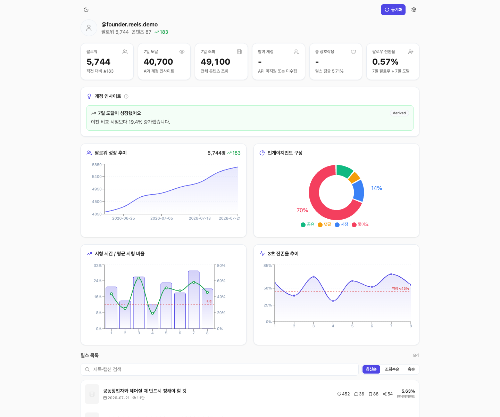

<!-- Language: **English** · [한국어](./README.ko.md) -->

# Instagram Dashboard

> **English** · [한국어](./README.ko.md)

A **local AI dashboard for Instagram Reels accounts**. It reads Instagram Graph API metrics,
**diagnoses where your Reels funnel leaks** (3-second hook → CTA → follow), and **suggests fixes**
— optionally emailing you a **daily best/worst report with an LLM-written summary**.



## Features

- **Diagnosis** — classifies 7 metrics (hook, completion, share, save, like, comment, follow
  conversion) into strengths / weaknesses / bottleneck, deterministic and reproducible (rule-based,
  not LLM)
- **AI generation** — from a diagnosis + transcript, generates hook/ending options and
  per-segment prescriptions
- **Trend charts** — views, reach, and follower growth over time
- **Daily email report** — optional best/worst reels + LLM summary every morning
- **Bring your own LLM** — Anthropic (Claude) / OpenAI / Kimi (Moonshot) / Gemini

## Quick start (demo data, no Instagram account needed)

```bash
npm install
npm run seed:demo   # loads a fictional sample account into data/
npm run dev
```

Open <http://localhost:3000> — the dashboard comes pre-populated with reels, diagnosis, and
follower charts.

## Connecting a real account

Requires a **professional (Business/Creator) Instagram account** and a long-lived Graph API
access token. Full walkthrough: [docs/INSTAGRAM_SETUP.md](./docs/INSTAGRAM_SETUP.md).

1. Create a Meta developer app and generate a token with the required Instagram permissions.
2. Add it in the dashboard's **⚙️ Settings** (`/settings`) — stored only in local `data/settings.json`.
3. Click **Sync** to pull your reels and followers.

## ⚠️ Security notice

This app has **no login/authentication**. Anyone who can reach it can read/change your stored
tokens and LLM keys, and trigger paid LLM calls.

- Run it **only on localhost or a trusted LAN.**
- If exposing it to the internet, **put an auth layer in front of it** (e.g. reverse proxy with
  Basic Auth) — never deploy it bare on a public IP.

## LLM provider setup

Set your API key and model in **⚙️ Settings** (`/settings`). Keys are stored locally
(`data/settings.json`, gitignored) and shown masked in the UI.

| Provider | Default model |
|---|---|
| Anthropic (Claude) | `claude-opus-4-8` |
| OpenAI | `gpt-4o` |
| Kimi (Moonshot) | `moonshot-v1-8k-vision-preview` |
| Google Gemini | `gemini-2.0-flash` |

## Development

```bash
npm test            # Jest unit tests
npm run typecheck   # tsc --noEmit
npm run build       # production build
```

Daily email report setup (cron/launchd) is documented in
[`scripts/launchd/README.md`](./scripts/launchd/README.md).

## License

[MIT](./LICENSE) © 2026 DongHyun Jung
